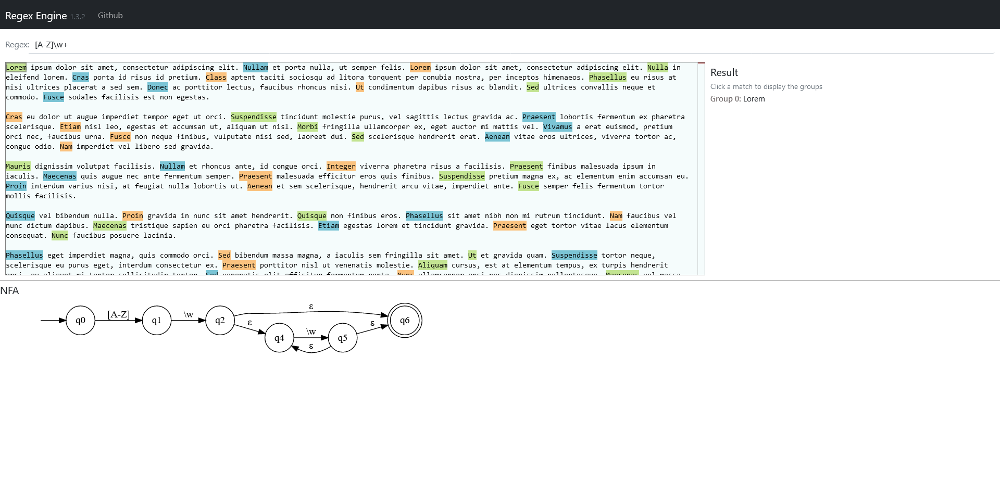

# Regex Engine
A regex engine based on NFA. The project also includes a webpage to visualize the generated NFA and test the results: https://danielbv.github.io/RegexEngine/.

> Disclaimer: This project is for educational projects and shouldn't be used in real development.

## Usage
First match:
```
const regex = new NFARegex("[a-zA-Z][a-zA-Z0-9_]*");
const match = regex.findFirstMatch("   myVar  ");
console.log(match.group(0)); //myVar
``` 
All matches:
```
const regex = new NFARegex("[a-zA-Z][a-zA-Z0-9_]*");
const matches = regex.findAllMatches("Remember Alf? He’s back, in pog form.");
console.log(matches.map(x => x.group(0))); //  [ "Remember", "Alf", "He", "s", "back", "in", "pog", "form" ]
``` 

If the regex is invalid it'll throw a parsing error.

## Tests
The tests are built with jest.
``` 
npm run test
```

## About the page
This project includes a page to test and visualize the regex. 


### Built with
* React
* React-bootstrap
* Monaco  - Input editor
* Viz.js - To create the NFA diagrams

### Execute the web
```
npm install
npm start
```

### Generate a static site
The main reason I did the engine in Javascript was to be able to create a static site and publish it on github pages.
The project has github actions configured to generate the page automatically when it detects a push in the main branch.

To build the page manually, run:
``` 
npm run build
``` 

## About the implementation
I intend to do several blog posts about the implementation of the regex engine. I'll update this with the links when it's ready.

## Supported syntax
### Character classes
Character classes match a set of characters:
* `.`: Match any single character (except linebreaks).
* `\d`: Match a single digit.
* `\D`: Match any single character that isn't a digit.
* `\w`: Match any word character (`[A-Za-z0-9_]`)
* `\W`: Match any character that isn't a word character (`[^A-Za-z0-9_]`)
* `\s`: Matches a single whitespace character
* `\S`: Matches any single non-whitespace character
* `[ab]`: Matches `a` or `b`
* `[a-z]`: Matches any single character between `a` and `z`.
* `[a-zA-Z_]`: Matches the character `_` or any single character that is inside the ranges `a-z` and `A-Z`
* `[^a-zA-Z_]`: Matches any single character that isn't `_` and isn't inside the ranges `a-z` and `A-Z`

### Quantifiers
Quantifiers specify how many times a part of the regular expression should be repeated.
* `*` – match zero or more times
* `+` – match one or more times
* `?` – match zero or one time

Quantifiers are greedy by default, so they'll match as much input as they can. To make them lazy add a `?` at the end: `*?`, `+?` and `??`

> A regex like `.*(\w+).*` would fail to capture complete words because `.*` is greedy. For the input `aaa` the regex `(\w+)` would 
> only match one `a`. To fix this make both `.*` lazy: `.*?(\w+).*?`

### Capturing groups
Capturing groups allow to extract the part of the input that matched the group. 
To create a capturing group just enclose a subexpression between parenthesis: `(subexpression)`

<table>
  <tr>
    <td><b>Regex<b></td>
    <td><code>(\w+)@(\w+)\.(\w+)</code></td>
  </tr>
  <tr>
    <td><b>Input<b></td>
    <td><code>myemail@gmail.com</code></td>
  </tr>
  <tr>
    <td><b>Result<b></td>
    <td> 
        Group 0: <code>myemail@gmail.com</code><br>
        Group 1: <code>myemail</code><br>
        Group 2: <code>gmail</code><br>
        Group 3: <code>com</code><br>
    </td>
  </tr>
</table>

The group 0 always contains the full text that matched. To access the value of the groups do `match.group(name)`. You can also set a name for 
the group instead of a increasing number using `(?<name>subexpression)` :
<table>
  <tr>
    <td><b>Regex<b></td>
    <td><code>(?&#60;user>\w+)@(?&#60;domain>\w+)\.(?&#60;extension>\w+)<code></td>
  </tr>
  <tr>
    <td><b>Input<b></td>
    <td><code>myemail@gmail.com</code></td>
  </tr>
  <tr>
    <td><b>Result<b></td>
    <td>
        Group 0: &nbsp&nbsp&nbsp&nbsp&nbsp&nbsp&nbsp&nbsp&nbsp&nbsp&nbsp&nbsp&nbsp <code>myemail@gmail.com</code><br>
        Group user: &nbsp&nbsp&nbsp&nbsp&nbsp&nbsp&nbsp&nbsp <code>myemail</code><br>
        Group domain: &nbsp&nbsp <code>gmail</code><br>
        Group extension: <code>com</code><br>
    </td>
  </tr>
</table>

If you want to group a expression but don't want to capture it, use a non capturing group `(?:subexpression)`
<table>
  <tr>
    <td><b>Regex<b></td>
    <td><code>(?:a+)(b+)<code></td>
  </tr>
  <tr>
    <td><b>Input<b></td>
    <td><code>aaabbb</code></td>
  </tr>
  <tr>
    <td><b>Result<b></td>
    <td> 
        Group 0: <code>aaabbb</code><br>
        Group 1: <code>bbb</code>
    </td>
  </tr>
</table>

## Alternation:
* `a|b`: Matches `a` or `b`

## Character escapes
There are multiple characters that have a special meaning. If instead you want to match that especific character you can escape it:
* `.`: Matches any character (except line breaks)
* `\.`: Matches the dot character

## Anchors
Anchors are a bit weird because they don't match characters. Instead they match positions:
* `^`: Matches the beginning of the string
* `$`: Matches the end of the string

Note: Some regex engines have multiline modes, in which the meaning of these anchors get expanded. Sadly this engine hasn't that mode :(.

**Without anchors**:
<table>
  <tr>
    <td><b>Regex (findAllMatches)<b></td>
    <td><code>\d+</code></td>
  </tr>
  <tr>
    <td><b>Input<b></td>
    <td><code>10 20 30</code></td>
  </tr>
  <tr>
    <td><b>Result<b></td>
    <td> 
        Match 0: <code>10</code><br>
        Match 1: <code>20</code><br>
        Match 1: <code>30</code>
    </td>
  </tr>
</table>

**With ^ anchor**:
<table>
  <tr>
    <td><b>Regex (findAllMatches)<b></td>
    <td><code>^\d+</code></td>
  </tr>
  <tr>
    <td><b>Input<b></td>
    <td><code>10 20 30</code></td>
  </tr>
  <tr>
    <td><b>Result<b></td>
    <td> 
        Match 0: <code>10</code>
    </td>
  </tr>
</table>

**With $ anchor**:
<table>
  <tr>
    <td><b>Regex (findAllMatches)<b></td>
    <td><code>\d+$</code></td>
  </tr>
  <tr>
    <td><b>Input<b></td>
    <td><code>10 20 30</code></td>
  </tr>
  <tr>
    <td><b>Result<b></td>
    <td> 
        Match 0: <code>30</code>
    </td>
  </tr>
</table>


## Nice things I could add but probably won't
- Allow character classes inside `[]`. For example: `[\w]+`
- `{n}`, `{n,}` and `{n,m}` quantifiers
- Backreferences (might be relatively easy if I change the matchers to decide how much input it consumes and giving it access to the memory)
- Multiple modes (case insensitive, multiline)
- Unicode escaping

## License
Distributed under the MIT License. See LICENSE.txt for more information.